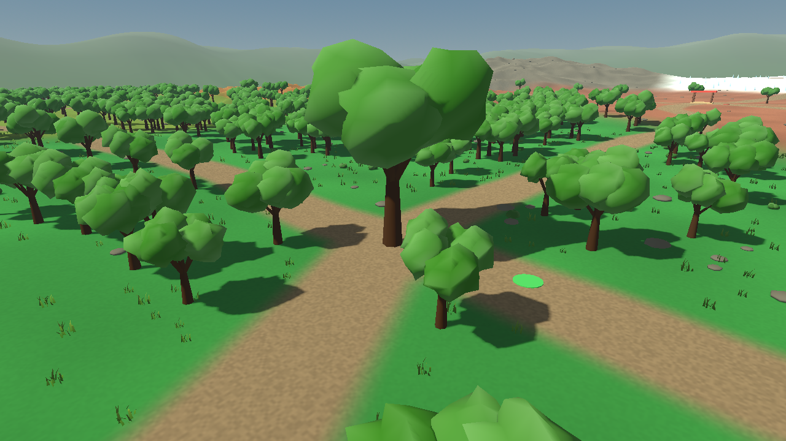
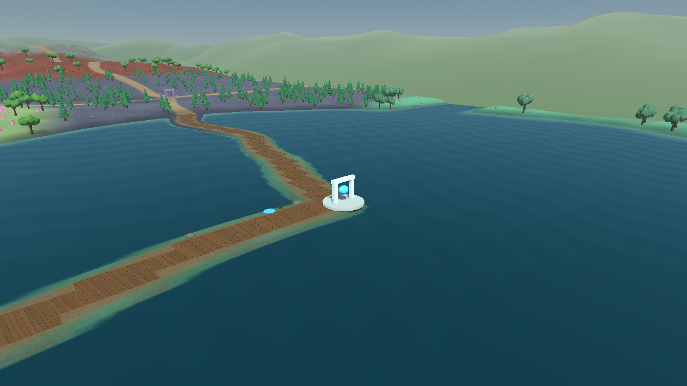

# Poképal Playhouse

A Godot 4.7 HD-2D / 2.5D Pokémon-style prototype: billboarded character sprites moving through a real 3D world.

## current prototype

- `CharacterBody3D` player with camera-relative movement.
- the existing player and Pokémon sprite assets retained at their original scale.
- bottom-anchored `AnimatedSprite3D` character visuals with fixed-Y billboarding.
- collision-aware free-orbit third-person camera using `SpringArm3D`.
- a generated world measuring 528 × 432 terrain cells, approximately 792 × 648 world units (four times the previous land area).
- seventeen large contiguous type-biome regions: one for every Pokémon type available in Generation IV.
- a connected network of narrower winding trails joining every region, plus four world-edge entrances.
- broad multi-feature elevation with mountain chains, peaks, plateaus, volcanic terrain, basins, badland ridges, forest hills and marsh lowlands.
- branched broadleaf trees, conifers, wetland trees, wind-stirred grass, animated water and continuous planked crossings.
- one large named signature landmark in every biome.
- an openable schematic world map with all seventeen landmarks and fast travel.
- wild Pokémon whose Generation IV primary type dictates their habitat region.
- indexed terrain in 238 independently culled chunks, with matching terrain collision and separate shore/tree blockers.
- one shared `AStarGrid2D` navigation cache built from the same water/tree walkability rules.

## Generation IV type world

Generation IV has seventeen Pokémon types; Fairy did not exist yet. The world contains one large region and one major destination for each type:

- **Normal — Central Meadow:** Heartstone Plaza and broad rolling central grassland.
- **Fire — Volcanic Basin:** Ember Crater inside a raised volcanic bowl with a depressed crater center.
- **Water — Lake District:** Tide Shrine, a large lake system, coves, an inlet and a walkable island.
- **Electric — Electric Plains:** Volt Substation across broad open terrain intended to remain highly visible from the free camera.
- **Grass — Deep Forest:** Ancient Grove inside a much wider rolling forest with a deliberate central clearing.
- **Ice — Snowfield:** Crystal Sanctum on a broad elevated glacial shelf.
- **Fighting — Training Plateau:** Red Belt Dojo on raised terrain between western and central routes.
- **Poison — Poison Marsh:** Toxic Wells surrounded by a much larger patterned wetland and scattered pools.
- **Ground — Badlands:** Dust Gate across raised ochre terrain with repeated ridge undulation.
- **Flying — Wind Plateau:** Skywatch Tower on a high open plateau.
- **Psychic — Psychic Garden:** Mind Crystal Garden on gently raised terrain east of the central meadow.
- **Bug — Bug Woods:** Grand Hive inside a much larger open woodland.
- **Rock — Mountain Range:** Summit Cairn among a broad mountain mass with several separate peaks and rocky ridges.
- **Ghost — Ghost Hollow:** Haunted Ruins inside a shallow basin ringed by sparse dark woodland.
- **Dragon — Dragon Peaks:** Dragon Shrine among the world's highest multi-peak terrain.
- **Dark — Dark Forest:** Eclipse Obelisk inside a larger dense northern forest.
- **Steel — Steel District:** Iron Forge on a broad raised industrial plateau.

The biome layout is a contiguous nearest-region partition rather than seventeen disconnected islands. Region centers are spaced much farther apart than the earlier prototype, so each biome has a substantial interior rather than reading as a small color patch. Designed route segments connect neighboring regions horizontally, vertically and through the central Normal hub, so there are multiple ways to travel around the map.

The world builder performs a startup connectivity pass. Disconnected pockets are excluded from navigation and habitat caches. No extra scenery walls are invented to conceal them.

## primary-type wild habitats

Wild Pokémon use their **first / slot-one type as it existed in Generation IV** to determine where they appear.

The project contains an offline National Dex 001–493 primary-type lookup. The spawner first selects an installed species, resolves that species' Generation IV primary type, and then asks the world builder for a walkable boundary and interior target in the matching biome. No network request is needed while the game is running.

Examples:

- Bulbasaur is Grass first, so it belongs to Deep Forest even though it is also Poison.
- Charizard is Fire first, so it belongs to Volcanic Basin even though it is also Flying.
- Gyarados is Water first, so it belongs to Lake District even though it is also Flying.
- Garchomp is Dragon first, so it belongs to Dragon Peaks even though it is also Ground.

Roaming targets are also chosen from the Pokémon's assigned biome, so visitors hang around their habitat instead of being given arbitrary world-wide wander destinations. They leave through the nearest cached walkable path cell at that biome's border.

Under the strict first-type rule, the Flying region has no natural wild population in the National Dex through Generation IV because none of those species has Flying in slot one. The region and Skywatch Tower remain fully explorable and available for fast travel; no secondary-type fallback is applied.

The enlarged world currently allows up to 34 temporary wild Pokémon, with spawn attempts roughly every 1.0–2.4 seconds while capacity is available. Species are selected before habitat assignment, so types with fewer species are not artificially weighted to appear as often as types with many species.

## biome landmarks

`WorldLandmarkSystem` composes each major destination from built-in Godot geometry. The Ancient Grove uses a mature version of the new branched woodland tree. These are intentionally larger and more recognizable than the repeated background motifs generated by `HgssWorldBuilder`.

Fast-travel arrival positions are separate from the visible landmark geometry. For every biome, the landmark system asks the world builder for a nearby verified walkable position, so map travel lands the player on ordinary navigable terrain rather than inside water or forest blockers.

All seventeen destinations are currently available immediately. Landmark unlocking/discovery can be layered on later without changing the destination interface.

## world map and fast travel

Press **Start / Esc** during gameplay to open the world map.

The map is schematic but is generated from the same biome centers and route graph used by the 3D world. Because it reads `WORLD_WIDTH`, `WORLD_DEPTH`, `BIOME_CENTERS` and `PATH_EDGES` directly, it automatically reflects the expanded region layout.

It displays:

- all seventeen biome landmarks;
- the route connections between biome centers;
- the player's current map position;
- the currently selected landmark.

Map controls:

- directional inputs / left stick: select a nearby landmark in that direction;
- `Button_A` / Space: fast travel to the selected landmark;
- `Button_Start` / Esc: close the map.

Player physics is disabled while the map is open and restored when it closes. Fast travel resets player velocity before resuming gameplay.

## camera

The camera is a collision-aware orbit rig centered above the player rather than a fixed-angle view.

Camera controls:

- hold right mouse and move the mouse: rotate and tilt;
- right stick: rotate and tilt continuously;
- mouse wheel: zoom between close and wide exploration distances.

Horizontal rotation is unrestricted. Vertical tilt is clamped from a near-horizontal view to a near top-down view so the camera cannot flip underneath the world. The existing `SpringArm3D` still shortens the camera distance when scenery blocks the view. Camera far distance is increased for the much larger world.

## expanded natural landscape

The playable landscape is **792 × 648 world units**, with the same character scale and walking speed. Biome anchors are twice as far apart along each axis, making each region substantially larger. All seventeen habitats, the existing Pokémon sprites, map controls, and fast-travel destinations remain available.

The world uses procedural geometry and native shaders; no external art download is required.

- Smooth biome colour transitions and fine world-space soil variation replace abrupt coloured cell boundaries.
- Narrower trails curve through the terrain, with feathered grass edges and graded slopes.
- A continuous meandering river crosses the lowlands and joins the lake district. Water is clipped against the actual terrain triangles, so shorelines follow the bed elevation.
- Continuous weathered plank surfaces cover graded river and lake crossings. Decks share the terrain's surface rather than using disconnected raised boxes.
- Broadleaf, evergreen, and wetland trees use coherent root, trunk, branch, and crown geometry. Irregular shrubs, tapered grass blades, and low stones give the foreground more detail. Foliage moves gently in the wind.
- Higher mountain regions, a procedural sky, distance haze, and distant hills give the free camera more depth. The outer hill ring is background scenery; the dimensions above describe the playable area.
- Ground rendering and collision use the same triangle diagonal and height interpolation. Fast travel and scenery placement sample those same triangles.

Actual Godot Compatibility renderer captures:





## performance and validation

Terrain uses indexed meshes in spatial chunks instead of submitting the entire world as one visible object. Repeated scenery is grouped into bounded MultiMesh batches; small grass, shrubs, and stones are culled at a shorter distance. Heights, normals, biome blends, and habitat data are prepared once during generation. Water and foliage animation run in shaders.

The complete default world currently generates synchronously at startup. In the development environment, headless generation took approximately 12–14 seconds, compared with roughly 4–5 seconds for the previous, smaller world. These are startup measurements, not a gameplay frame-rate guarantee.

Run the integration check with Godot 4.7 after importing the project:

```bash
godot --headless --path . --editor --import
godot --headless --path . --fixed-fps 60 --script res://tests/world_generation_smoke.gd
```

The check loads the real main scene, verifies paths and habitat entries for all seventeen regions, checks every route triangle against the player's slope limit, validates spatial batch bounds, and physically lands the player at every fast-travel destination.

## installing the Pokémon sprite folder

Character sprites are separate from the procedural world. The project expects numbered Pokémon folders inside:

```text
res://assets/pokemon/hgss_overworld/
```

To populate them from the existing sprite source:

```bash
./tools/download_hgss_overworld.sh ./assets/pokemon/hgss_overworld
```

Godot must finish importing the PNG files before the runtime Pokémon loader can see them.

## roaming Pokémon

`WildPokemonSpawner` discovers installed species, `PokemonGen4TypeLibrary` resolves their Generation IV primary type, and `HgssWorldBuilder` provides matching biome entry, wandering and exit positions. `HgssWorldNavigation` maintains one shared A* grid so all temporary Pokémon still use the same water/tree collision rules.

Current behaviour:

1. choose a random installed species;
2. resolve its Generation IV first type;
3. choose one available form of that species;
4. enter on a walkable route cell at the matching type-biome boundary;
5. move to a walkable interior cell in the same biome;
6. idle and wander between nearby cells selected from that biome;
7. remain for roughly 22–48 seconds;
8. route toward the nearest walkable boundary cell of the same biome;
9. despawn on exit.

The current population cap is 34 temporary Pokémon.

## run

Open `project.godot` with Godot 4.7 and press F5.

Gameplay controls:

- WASD, arrow keys, or left stick: move;
- right mouse drag or right stick: rotate / tilt camera;
- mouse wheel: camera zoom;
- Start / Esc: open the world map;
- the player starts in the expanded central Normal Meadow;
- follow the connected route network outward or use the map to fast travel between landmark destinations.

## architecture

```text
scenes/
├── camera/
│   └── camera_rig.tscn
├── characters/
│   ├── ditto_visual.tscn
│   ├── pokemon_visual.tscn
│   ├── player.tscn
│   └── wild_pokemon.tscn
└── world/
    └── main.tscn

scripts/
├── camera/
│   └── camera_rig.gd
├── characters/
│   ├── billboard_character_visual.gd
│   ├── bottom_anchored_animated_sprite_3d.gd
│   ├── player_controller.gd
│   ├── pokemon_gen4_type_library.gd
│   ├── pokemon_sprite_library.gd
│   └── wild_pokemon.gd
├── core/
│   └── input_bootstrap.gd
├── ui/
│   ├── world_map_canvas.gd
│   └── world_map_overlay.gd
└── world/
    ├── hgss_world_builder.gd
    ├── hgss_world_navigation.gd
    ├── wild_pokemon_spawner.gd
    ├── world_field_sampler.gd
    ├── world_terrain_renderer.gd
    ├── world_instance_batcher.gd
    ├── world_scenery_meshes.gd
    ├── world_horizon.gd
    └── world_landmark_system.gd
```

`HgssWorldBuilder` coordinates layout, connectivity, type-habitat caches, and walkable-position queries. `WorldFieldSampler` supplies deterministic geographic fields. `WorldTerrainRenderer` builds indexed terrain, contour-clipped water, and matching terrain collision. `WorldSceneryMeshes` owns reusable organic mesh geometry; `WorldInstanceBatcher` owns spatial scenery batching. `WorldHorizon` owns distant background terrain. Surface shaders live in `resources/shaders/`. `PokemonGen4TypeLibrary` owns the offline Generation IV primary-type lookup. `WorldLandmarkSystem` owns the seventeen major landmark structures plus safe fast-travel destinations. `WorldMapOverlay` and `WorldMapCanvas` own map presentation and travel controls. `HgssWorldNavigation` owns the shared grid pathfinder. `WildPokemonSpawner` owns population policy.

## temporary player art

The current player visual points at `resources/sprite_frames/player_overworld.tres`. A replacement player-specific `SpriteFrames` resource should preserve these animation names:

```text
idle_down
idle_up
idle_left
idle_right
walk_down
walk_up
walk_left
walk_right
```

The player movement controller does not need to change.
